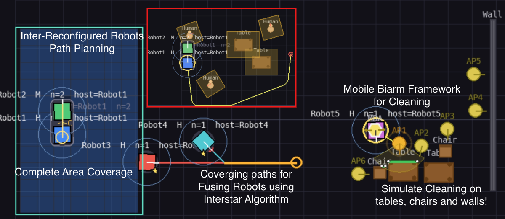

# Scalable Computation — Inter-Reconfigurable Robots

[](LICENSE)
[](https://www.python.org/)
[]()

> Reference implementation of three published algorithms for inter-reconfigurable robot autonomy, each with provable complexity bounds and verified on physical platforms.



**New to inter-reconfigurable robots?** Run `python demo.py` — the interactive sandbox is designed for researchers, students, and developers to learn, build on, and experiment with the three algorithms in a unified scene.

---

## Algorithms

| Module | Contribution | Headline | Venue |
|--------|--------------|----------|-------|
| [`configurer/`](configurer/) — `open_configurer.py` | FSM for fusion / fission control — *Constant Complexity Framework* | O(n) → O(1) complexity | [IEEE T-ASE 2024](https://ieeexplore.ieee.org/abstract/document/10589354) |
| [`interstar/`](interstar/) — `open_interstar.py` | Modified Multi-A* for docking / splitting robots — *Inter-Star Algorithm* | O(log n · x) complexity | [Elsevier ESWA 2025](https://www.sciencedirect.com/science/article/abs/pii/S0957417425027514) |
| [`gbnnh/`](gbnnh/) — `open_gbnnh.py` | Hierarchical GBNN for dual-arm coverage — *GBNN+H* | Heuristic runtime speedup over baseline GBNN | [Springer Complex & Intelligent Systems 2024](https://link.springer.com/article/10.1007/s40747-024-01483-3) |

Click a module name to land on its README — each contains the full paper citation (BibTeX), DOI link, and funding details.

> *Two additional algorithms from the same thesis are slated for future releases.*

---

## Disclaimer — Simplified simulation

This codebase is a **simplified simulation adaptation** of the original work performed at SUTD on physical inter-reconfigurable robot platforms. The simulation is intended as a reference implementation of the algorithms; some aspects of the deployed system are abstracted, simplified, or omitted entirely.

In particular, the simulation may not fully represent:

- **Distributed execution** — the original system runs as multiple distributed robots with centralised planning and inter-robot communication. The simulation runs everything in a single process; networked communication is not modelled.
- **Behavioural recovery** — failure detection, fallback strategies, and re-planning under fault are not represented.
- **Docking methodology** — the simulation uses geometric snap-together docking; the deployed system uses physical alignment / latching protocols with sensor-driven feedback.
- **Hardware dynamics** — rolling friction, motor torque limits, caster physics, sensor noise, and other real-world effects are not modelled.

Treat this codebase as the algorithmic core of the published work — useful for understanding, replicating, and building on the algorithms — but not as faithful representations of the deployed hardware system.

---

## Prerequisites

- **Python 3.9 or newer** — check with `python3 --version`
- **pip** — bundled with modern Python
- **git** — for cloning the repository

The algorithm classes themselves (`Configurer`, `Interstar`, `GBNN_H`) only depend on `numpy`, `scipy`, and `pyyaml`. The interactive demo additionally needs `matplotlib` and `pygame`.

---

## Installation

```bash
git clone https://github.com/AshWan13/scalable-computation.git
cd scalable-computation
pip install -e ".[matplotlib,pygame]"
```

Other install variants:

- `pip install -e .` — algorithm classes only. Use this if you just want to import the classes into your own project.
- `pip install -e ".[matplotlib]"` — adds matplotlib for headless visualisation.
- `pip install -e ".[pygame]"` — adds pygame for the interactive teleop sandbox.
- `pip install -e ".[dev]"` — adds pytest, ruff, black for development.

---

## Running the demo

From the repository root:

```bash
python demo.py
```

This launches the unified matplotlib + pygame sandbox, combining the three algorithms into a single interactive scene — teleop a robot, place obstacles, trigger Inter-Star path planning, run GBNN+H coverage.

### Importing classes into your own code

```python
from configurer.open_configurer import Configurer
from interstar.open_interstar import Interstar
from gbnnh.open_gbnnh import GBNN_H

# Each class is importable standalone — no rendering dependencies.
```

### Platform-specific notes

<details>
<summary><strong>macOS</strong> (Apple Silicon and Intel)</summary>

Tested on macOS 12+ with Python 3.9–3.11. The cleanest setup uses a virtualenv inside the cloned repo so pip is fresh enough for PEP 660 editable installs:

```bash
cd scalable-computation
python3 -m venv .venv
source .venv/bin/activate
pip install --upgrade pip setuptools wheel
pip install -e ".[matplotlib,pygame]"
python demo.py --test
python demo.py
```

To leave the venv: `deactivate`. To re-enter next time: `source .venv/bin/activate` from the repo root.

**Anaconda users:** the conda `(base)` env often ships with an older pip that fails on PEP 660 editable installs (you'll see *"setup.py not found... editable mode currently requires a setup.py based build"*). Use a dedicated conda env instead:

```bash
conda create -n scalable-comp python=3.11 -y
conda activate scalable-comp
pip install -e ".[matplotlib,pygame]"
python demo.py --test     # headless sanity check; expected: "All Phase A + B headless tests PASSED."
python demo.py            # interactive sandbox
```

To leave: `conda deactivate`. To re-enter: `conda activate scalable-comp` from any directory.

**If pygame fails to load with an SDL error**, install the system SDL2 dependency via Homebrew:

```bash
brew install sdl2 sdl2_image sdl2_ttf
pip install --force-reinstall pygame
```

The matplotlib `macosx` backend is the default and needs no extra setup. If you see a blank window, try `MPLBACKEND=TkAgg python demo.py`.
</details>

<details>
<summary><strong>Windows</strong> (10 / 11)</summary>

Tested with Python 3.9–3.11 installed from python.org. pygame and matplotlib install cleanly via pip wheels — no extra system packages needed.

In PowerShell:

```powershell
python --version
pip install -e ".[matplotlib,pygame]"
python demo.py
```

If the demo window doesn't appear, confirm you're not running inside WSL without a display server (use a native Windows Python install, or set up an X server like VcXsrv if you must use WSL).
</details>

<details>
<summary><strong>Linux</strong> (Ubuntu / Debian)</summary>

Install Python tooling, the `venv` module, and system display libraries in one go:

```bash
sudo apt update
sudo apt install -y python3 python3-pip python3-venv python-is-python3 \
                    python3-tk libsdl2-dev libsdl2-image-dev libsdl2-ttf-dev
```

What each does:
- `python3-venv` — required to create virtualenvs (Ubuntu doesn't include it by default).
- `python-is-python3` — aliases `python` to `python3` so the demo commands work without typing `python3` every time.
- `python3-tk` — Tk backend for matplotlib (required if you want the matplotlib visualisations).
- `libsdl2-*` — SDL2 display libraries needed by pygame.

Then create a virtualenv inside the repo and install (the venv ships its own modern pip, which is required for the package's PEP 660 editable install):

```bash
cd scalable-computation
python3 -m venv .venv
source .venv/bin/activate
pip install --upgrade pip setuptools wheel
pip install -e ".[matplotlib,pygame]"
python demo.py --test     # headless sanity check; no display needed
python demo.py            # interactive sandbox
```

To leave the venv: `deactivate`. To re-enter it next time: `source .venv/bin/activate` from the repo root.

**Python 3.8 (Ubuntu 20.04 default) is not officially supported** — the package requires 3.9+. On 20.04, install a newer Python via deadsnakes PPA:
```bash
sudo add-apt-repository ppa:deadsnakes/ppa && sudo apt update
sudo apt install -y python3.11 python3.11-venv
python3.11 -m venv .venv     # use python3.11 explicitly when creating the venv
```

If running over SSH or in a container, enable X11 forwarding (`ssh -X user@host`) or use a virtual display (`xvfb-run python demo.py`).
</details>

### Quick sanity check

Without launching pygame, verify the package is importable:

```bash
python -c "from configurer.open_configurer import Configurer; print('OK')"
```

---

## Using the demo

Once `demo.py` is launched, the interactive sandbox accepts the keyboard and mouse controls below. The active behaviour depends on which robot you have selected — each of the five robots may operate independently or fused.

### Active robot selection

Number keys `1`–`5` select which robot is currently active for control. The number corresponds to the robot's ID (Robot 1 through Robot 5). All five robots share the same set of capabilities — the behaviour that engages depends on which planner you trigger via the controls below (manual teleop, point-to-point navigation, GBNN coverage, Inter-Star multi-robot fusion / fission, or GBNN+H hierarchical coverage).

### Manual driving

| Input | Action |
|-------|--------|
| `W` `A` `S` `D` | Drive forward / rotate left / reverse / rotate right (differential) |
| `↑` `↓` `←` `→` (arrow keys) | Drive forward / reverse / strafe left / strafe right (holonomic) |
| `Q` | Increase speed scale |
| `E` | Decrease speed scale |
| `LMB-click` (empty floor) | Set point-to-point goal |

### Path planner selection

- `P` — toggle pathfinding algorithm between **A\*** and **Dijkstra's**.

### Motion control mode

- `M` — cycle motion model: **differential drive** → **holonomic** → **hybrid**.

### Robot fusion / fission

- `Shift + 1`–`5` — fuse the currently-selected robot to target robot N (keyboard-driven fusion).
- `Space` — fission: split the currently-selected formation.
- In Mode 2 (Inter-Star), fusion / fission is dispatched **automatically** when the multi-robot path requires reconfiguration.

### Trolley docking

- `T` — toggle trolley attachment / detachment for the selected robot.

### Access points (Mode 5, GBNN+H)

- `Shift + LMB` on empty floor near (within 1.2 m of) an obstacle places an access point. Yaw points from the click toward the nearest obstacle's nearest surface point.
- `0` — mount / unmount the MDA module on the selected host robot.
- `Enter` — start the cleaning sequence. Access points are visited in greedy nearest-neighbour order from the current host pose.
- `Tab` — toggle the surface-view sub-panel (per-AP merged grid).

### Obstacles

- **Spawn:** click an obstacle button in the right-side toolbar, then click-and-drag in the scene. Drag direction sets the angle (walls, sliding doors, pivot doors); drag length / radius sets the size for variable-size obstacles (walls, pillars).
- **Despawn / clear all:** `C` clears every obstacle in the scene.
- **Reset scenario:** `R` respawns the default scenario.

### Cancelling and exiting

- `X` — cancel the current navigation for the selected robot's formation.
- `Esc` — cancel current selection / fission queue / active plan; press again with nothing active to quit.

### Rotation centre

- `Z` — toggle the rotation centre between **centroid** and **host robot position**.

### Framework initialisation

The demo spawns a default scenario on launch (`R` respawns at any time). Tunable parameters live as constants near the top of `demo.py` (`N_ROBOTS`, `ROBOT_OCCUPANCY_M`, `MDA_ARM_REACH_M`, `GBNNH_FRAMES_PER_STEP`, etc.) — edit and re-launch to change formation size, robot footprint, or cleaning cadence.

---

## Troubleshooting

- **`ModuleNotFoundError: No module named 'configurer'`** — Run from the repository root after `pip install -e .`. The `python` you invoke must be the same interpreter where you ran pip.
- **pygame window won't open / `No available video device` on Linux** — Install `libsdl2-dev`, then either run `python demo.py` from a desktop session, use `xvfb-run python demo.py` for headless, or enable X11 forwarding (`ssh -X user@host`) over SSH.
- **Matplotlib opens a blank window on macOS** — Try `MPLBACKEND=TkAgg python demo.py`. The python.org installer ships with Tk; pyenv builds may need `--enable-framework`.
- **Slow rendering / unresponsive demo** — Some demo modes open a fresh matplotlib figure per step. Close inactive windows, or run only one algorithm mode at a time.
- **`pip install -e .` fails on Apple Silicon** — Update pip first (`pip install -U pip setuptools wheel`), then re-run.

## Citation

Machine-readable citation metadata is in [`CITATION.cff`](CITATION.cff). To cite a specific algorithm, use the BibTeX block from that module's README.

## License

Released under the [BSD 3-Clause License](LICENSE). Copyright © 2025 Singapore University of Technology and Design and Ash Wan Yaw Sang.

The Glasius Bioinspired Neural Network reference implementation in [`replicated_gbnn.py`](replicated_gbnn.py) is a re-implementation of prior work by Glasius, Komoda, & Gielen (1995). The A\* algorithm (Hart, Nilsson, & Raphael, 1968) and Dijkstra's algorithm (Dijkstra, 1959) are included as base path-planning functions used to demonstrate deployed inter-reconfigurable robots. Credit for these classical algorithms belongs to their original authors.

---

## Repository layout

```
scalable-computation/
├── README.md                ← you are here
├── LICENSE                  BSD 3-Clause
├── CITATION.cff
├── pyproject.toml
├── requirements.txt
├── .gitignore
│
├── demo.py                  unified matplotlib + pygame demo
│
├── common/                  shared utilities
│   ├── obstacles.py             obstacle / collision system
│   └── replicated_gbnn.py       reference impl of GBNN (Glasius et al. 1995)
│
├── configurer/              Constant Complexity Framework (T-ASE 2024)
│   ├── open_configurer.py
│   └── README.md            paper details + BibTeX + DOI
│
├── interstar/               Inter-Star Algorithm (ESWA 2025)
│   ├── open_interstar.py
│   └── README.md
│
└── gbnnh/                   GBNN+H (Complex & Intelligent Systems 2024)
    ├── open_gbnnh.py
    └── README.md
```

## Acknowledgements

This work has been adapted into a simplified simulation. The original work was carried out at the [Singapore University of Technology and Design](https://www.sutd.edu.sg/) under the supervision of **Prof. Mohan Rajesh Elara**. The first author was supported by the **SUTD President's Graduate Fellowship — Computing and Information Science Disciplines**.

This research was supported by the National Robotics Programme under its NRP BAU, *Ermine III: Deployable Reconfigurable Robots* (Award No. **M22NBK0054**), and by A\*STAR under the RIE2025 IAF-PP programmes — *Advanced ROS2-native Platform Technologies for Cross-sectorial Robotics Adoption* (Award No. **M21K1a0104**) and *Modular Reconfigurable Mobile Robots (MR)²* (Grant No. **M24N2a0039**). Per-paper funding details are in each module's README.

The codebase builds on:

- The **Glasius Bioinspired Neural Network** reference implementation (Glasius, Komoda & Gielen, 1995) — see [`common/replicated_gbnn.py`](common/replicated_gbnn.py).
- Classical **A\*** (Hart, Nilsson & Raphael, 1968) and **Dijkstra's** (Dijkstra, 1959) shortest-path algorithms — implemented as helpers in [`common/obstacles.py`](common/obstacles.py).
- The open-source scientific Python community — numpy, scipy, matplotlib, pygame.

## Contact

Dr. Ash Wan Yaw Sang — yaw_sang94@hotmail.com · [LinkedIn](https://linkedin.com/in/ashwanyawsang)
